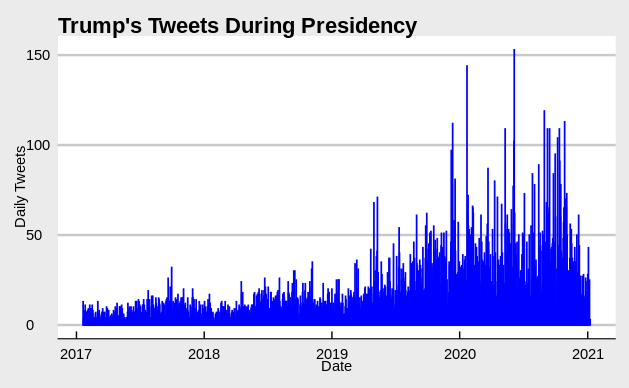
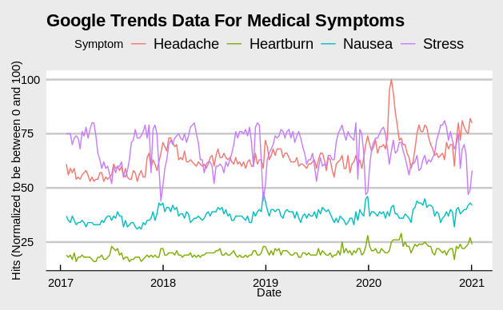

# Analyzing Trends in Presidential Tweets
## A codecademy R Capstone Project

**Objective:** Using R and R-Studio, investigate a topic of your choosing using Google Trends data. Include data from one additional source that is related to your search terms. This project should test your skills in the following areas:

- Finding and exploring new datasets
- Manipulating and cleaning those datasets to help answer your essential questions
- Creating visualizations from those datasets
- Building statistical models

Programming languages and libraries used: 
- R
- gtrendsR
- tidyverse
- dplyr
- ggplot
- maps

Click [here](capstone_project.nb.html) for the code notebook rendered in html.
